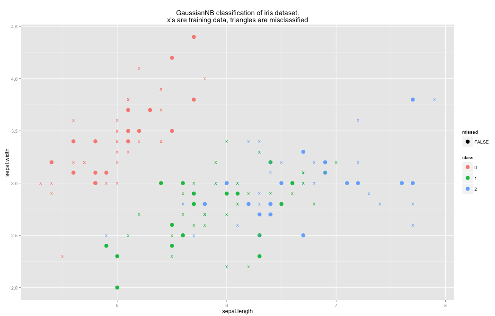

Naive Bayes classifier in Scalding. So far, it supports multinomial and normally distributed input data.

Example usage:

```scala
class NBTestJob(args: Args) extends Job(args) {
  val input = args("input")
  val output = args("output")

  val iris = Tsv(input, ('id, 'class, 'sepalLength, 'sepalWidth, 'petalLength, 'petalWidth))
    .read

  val irisMelted = iris
    .unpivot(('sepalLength, 'sepalWidth, 'petalLength, 'petalWidth) -> ('feature, 'score))

  val irisTrain = irisMelted.filter('id){id: Int => (id % 3) != 0}.discard('id)

  val irisTest = irisMelted
    .filter('id){id: Int => (id % 3) ==0}
    .discard('class)

  val model = GaussianNB.train(irisTrain)
    .write(Tsv("model.tsv"))

  val predictions = GaussianNB.classify(irisTest, model).rename(('id, 'class) -> ('id2, 'classPred))

  val results = iris
    .leftJoinWithTiny('id -> 'id2, predictions)
    .discard('id2)
    .map('classPred -> 'classPred) {x: String => Option(x).getOrElse("")}
    .project('id, 'class, 'classPred, 'sepalLength, 'sepalWidth)
    .write(Tsv(output))

}
```

The above code classifies all of the species in the iris data set correctly:

